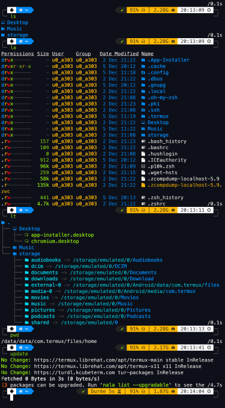
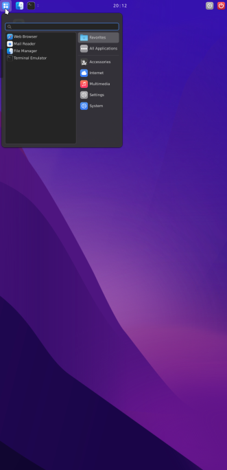

# OhMyTermux 🧊


### **From selecting a shell to applying a cursor pack to performing stylish clicks in a complete Debian development environment that fits in your pocket  : dozens of parameters are available in [OhMyTermux](https://github.com/GiGiDKR/OhMyTermux).**

     
 

## Installation

1. Install Termux from [F-Droid](https://f-droid.org/en/packages/com.termux), [GitHub](https://github.com/termux/termux-app) or [Play Store](https://play.google.com/store/apps/details?id=com.termux&pcampaignid=web_share).

2. Install **OhMyTermux** with **[Gum](https://github.com/charmbracelet/gum)** (**recommended**🔥) :
```bash
curl -sL https://raw.githubusercontent.com/GiGiDKR/OhMyTermux/1.0.0/install.sh -o install.sh && chmod +x install.sh && ./install.sh --gum
```

<details>

<summary>🧊 Alternative installation method</summary>

```bash
curl -sL https://raw.githubusercontent.com/GiGiDKR/OhMyTermux/1.0.0/install.sh -o install.sh && chmod +x install.sh && ./install.sh
```

</details>

<details>

<summary>✅ Functional arguments</summary>

 ```
--gum | -g              # Using Gum as Command Line Interface
--shell | -sh           # Shell selection
--package | -pk         # Packages installation
--xfce | -x             # XFCE installation
--proot | -pr           # Debian PRoot installation
--font | f              # Font selection
--x11 | -x              # Termux-X11 installation
--skip | -sk            # Skip initial configuration
--verbose | -v          # Detailed outputs
--help | -h             # Show help
```

</details>

## About this program

### 🧊 **Termux**

<details>

<summary>Packages installed by default</summary>

- [wget](https://github.com/mirror/wget)
- [curl](https://github.com/curl/curl)
- [git](https://github.com/git/git)
- [unzip](https://en.m.wikipedia.org/wiki/ZIP_(file_format))

</details>

<details>

<summary>Individually selectable packages</summary>

- [nala](https://github.com/volitank/nala)
- [eza](https://github.com/eza-community/eza)
- [lsd](https://github.com/lsd-rs/lsd)
- [logo-ls](https://github.com/Yash-Handa/logo-ls)
- [bat](https://github.com/sharkdp/bat)
- [lf](https://github.com/gokcehan/lf)
- [fzf](https://github.com/junegunn/fzf)
- [glow](https://github.com/charmbracelet/glow)
- [python](https://github.com/python)
- [nodejs](https://github.com/nodejs/node)
- [nodejs-lts](https://github.com/nodejs/Release)
- [micro](https://github.com/zyedidia/micro)
- [vim](https://github.com/vim/vim)
- [neovim](https://github.com/neovim/neovim)
- [lazygit](https://github.com/jesseduffield/lazygit)
- [open-ssh](https://www.openssh.com/)

</details>

<details>

<summary>Shell selection</summary>

- [Bash](https://git.savannah.gnu.org/cgit/bash.git/)
- [ZSH](https://www.zsh.org/)
- [Fish](https://github.com/fish-shell/fish-shell)

</details>
 
<details>

<summary>Zsh configuration</summary>

- [Oh-My-Zsh](https://github.com/ohmyzsh/ohmyzsh)
- [zsh-syntax-highlighting](https://github.com/zsh-users/zsh-syntax-highlighting)
- [zsh-completions](https://github.com/zsh-users/zsh-completions)
- [zsh-you-should-use](https://github.com/MichaelAquilina/zsh-you-should-use)
- [zsh-alias-finder](https://github.com/ohmyzsh/ohmyzsh/tree/master/plugins/alias-finder)

</details>
    
<details>

<summary>Fish configuration</summary>

- ~~[Oh-My-Fish](https://github.com/oh-my-fish/oh-my-fish)~~
- [Fisher](https://github.com/jorgebucaran/fisher)
- [Tide](https://github.com/IlanCosman/tide)
- ~~[Pure](https://github.com/pure-fish/pure)~~
- ~~[Fishline](https://github.com/0rax/fishline)~~
- ~~[Virtualfish](https://github.com/justinmayer/virtualfish)~~
- ~~[Fish Abbreviation Tips](https://github.com/gazorby/fish-abbreviation-tips)~~
- ~~[Bang-Bang](https://github.com/oh-my-fish/plugin-bang-bang)~~
- ~~[Fish You Should Use](https://github.com/paysonwallach/fish-you-should-use)~~
- ~~[Catppuccin for Fish](https://github.com/catppuccin/fish)~~

</details>
 
<details>

<summary>Termux Display</summary>

- [Nerd Fonts](https://github.com/ryanoasis/nerd-fonts) 
- [Powerlevel10k](https://github.com/romkatv/powerlevel10k)
- [Oh-My-Posh](https://github.com/JanDeDobbeleer/oh-my-posh)
- [Starship](https://github.com/starship/starship)

</details>
 
<details>

<summary>Termux configuration</summary>

- Custom aliases (common aliases + specific aliases depending on the package or plugin installed)
  
</details>

### 🧊 **XFCE**

- Setup an [XFCE](https://wiki.termux.com/wiki/Graphical_Environment#XFCE) desktop for native Termux environment.

- Using [Termux-X11](https://github.com/termux/termux-x11) : the server as well as the APK are downloaded and then installed from Termux or manually.

- ✅ 3 configurations are available :
    <details>

    <summary>1️⃣ Minimal</summary>
    
    Only the necessary packages :
    ```
    termux-x11-nightly        # Termux-X11
    virglrenderer-android     # VirGL
    xfce4                     # XFCE
    xfce4-terminal            # Terminal
    ```
    </details>

    <details>

    <summary>2️⃣ Recommended</summary>
 
    Minimal installation + following packages :
    ```
    netcat-openbsd            # Network Utility
    pavucontrol-qt            # Sound Control
    thunar-archive-plugin     # Archives
    wmctrl                    # Window Control 
    xfce4-notifyd             # Notifications
    xfce4-screenshooter       # Screenshot
    xfce4-taskmanagerb        # Task Manager
    xfce4-whiskermenu-plugin  # Whisker Menu
    ```
    And the following interface elements :
    ```
    WhiteSur-Theme            # https://github.com/vinceliuice/WhiteSur-gtk-theme
    WhiteSur-Icon             # https://github.com/vinceliuice/WhiteSur-icon-theme
    Fluent-Cursors            # https://github.com/vinceliuice/Fluent-cursors
    WhiteSur-Wallpapers       # https://github.com/vinceliuice/WhiteSur-wallpapers
    ```
    </details>

    <details>
 
    <summary>3️⃣ Custom</summary>
    
    The contents of the Minimal installation + the choice among :
    ```
    jq                        # JSON Utility
    gigolo                    # File Manager
    mousepad                  # Text Editor
    netcat-openbsd            # Network Utility
    parole                    # Media Player
    pavucontrol-qt            # Sound Control
    ristretto                 # Image Manager
    thunar-archive-plugin     # Archives
    thunar-media-tags-plugin  # Media
    wmctrl                    # Window Control
    xfce4-artwork             # Artwork
    xfce4-battery-plugin      # Battery
    xfce4-clipman-plugin      # Clipboard
    xfce4-cpugraph-plugin     # CPU Graph
    xfce4-datetime-plugin     # Date and Time
    xfce4-dict                # Dictionary
    xfce4-diskperf-plugin     # Disk Performance
    xfce4-fsguard-plugin      # Disk Monitoring
    xfce4-genmon-plugin       # Generic Widgets
    xfce4-mailwatch-plugin    # Mail Monitoring
    xfce4-netload-plugin      # Network Loading
    xfce4-notes-plugin        # Notes
    xfce4-notifyd             # Notifications
    xfce4-places-plugin       # Places
    xfce4-screenshooter       # Screenshot
    xfce4-taskmanager         # Task Manager
    xfce4-systemload-plugin   # System Load
    xfce4-timer-plugin        # Timer
    xfce4-wavelan-plugin      # Wi-Fi
    xfce4-weather-plugin      # Weather Information
    xfce4-whiskermenu-plugin  # Whisker Menu
    ```
    The choice among following interface elements :
    
    Theme :
    ```
    WhiteSur-Theme            # https://github.com/vinceliuice/WhiteSur-gtk-theme
    Fluent-Theme              # https://github.com/vinceliuice/Fluent-gtk-theme
    Lavanda-Theme             # https://github.com/vinceliuice/Lavanda-gtk-theme 
    ```
    Icons :
    ```
    WhiteSur-Icon             # https://github.com/vinceliuice/WhiteSur-icon-theme
    McMojave-Circle           # https://github.com/vinceliuice/McMojave-circle-icon-theme
    Tela-Icon                 # https://github.com/vinceliuice/Tela-icon-theme
    Fluent-Icon               # https://github.com/vinceliuice/Fluent-icon-theme
    Qogir-Icon                # https://github.com/vinceliuice/Qogir-icon-theme
    ```
    Cursors :
    ```
    Fluent-Cursors            # https://github.com/vinceliuice/Fluent-cursors
    ```
    Wallpapers :
    ```
    WhiteSur-Wallpapers       # https://github.com/vinceliuice/WhiteSur-wallpapers
    ```
    </details>

- The ability to install a web browser, either [Chromium](https://www.chromium.org/) or Firefox.

> [!IMPORTANT]
> The recommended installation uses approximately **3,5 GB** of disk space.

### 🧊 **Debian**
[Debian PRoot](https://wiki.termux.com/wiki/PRoot) installation with an [application installer](https://github.com/GiGiDKR/App-Installer) that are unavailable with Termux or Debian package managers.

## Usage

- ```start``` : start a Termux-X11 session.

- ```debian``` : access Debian PRoot installation from the terminal.

</details>

## Screenshots




## Error : _Signal 9_
> [!WARNING]
> ```Process completed (signal 9) - press Enter```

<details>
  
<summary>How to fix this error</summary>

You need to run this adb command to fix the process 9 error that will force close Termux :
```
adb shell "/system/bin/device_config put activity_manager max_phantom_processes 2147483647"
```
To do this without using a PC you have several methods :
First, Connect to WIFI.

**Method 1 :** 
Install adb in Termux by running this code:
```
pkg install android-tools -y
```
Then open settings and enable developer's options by selecting "About phone" then hit "Build" 7 times.

Back out of this menu and go into developer's options, enable wireless debugging then click into there to get the port number then click pair device to get the pairing code.

Put settings into split screen mode by pressing the square button on the bottom right of your phone, and hold the settings icon until the split screen icon shows up.

Then select Termux and in settings select pair with a code. In Termux type `adb pair` then enter your pairing info.

After you have completed this process you can type adb connect and connect to your phone with the ip and port provided in the wireless debugging menu. You can then run the fix command :

```adb shell "/system/bin/device_config put activity_manager max_phantom_processes 2147483647"```

**Method 2 :**

Install LADB from [Playstore](https://play.google.com/store/apps/details?id=com.draco.ladb) or from [GitHub](https://github.com/hyperio546/ladb-builds/releases).

In split screen have one side LADB and the other side showing developer settings.
In developer settings, enable wireless debugging then click into there to get the port number then click pair device to get the pairing code.
Enter both those values into LADB.
Once it connects run the fix command :

```adb shell "/system/bin/device_config put activity_manager max_phantom_processes 2147483647"```

</details>


## 💻 Version history

Version 1.0.0 :
 - Initial release

## 📖 To Do
- [X] Separate XFCE / Debian install to run native Termux XFCE
- [X] Add selectable graphical interface elements (Themes, Fonts, Cursors, Wallpapers)
- [X] Add a password for the Debian proot user
- [ ] Integrate Fish configuration (Plugins, Prompts, Alias)
- [ ] Add more selectable packages
- [ ] Add Python modules
- [ ] Integrate a Termux theme selection
- [ ] Integration of [OhMyTermuxScript](https://github.com/GiGiDKR/OhMyTermuxScript)
- [ ] Integration of [OhMyObsidian](https://github.com/GiGiDKR/OhMyObsidian)

> [!TIP]
> 🚩 French version is [available](README.fr.md).

## A short overview :

https://github.com/user-attachments/assets/ec49fc8d-bc69-4b95-ade4-5ca2ae57a105


