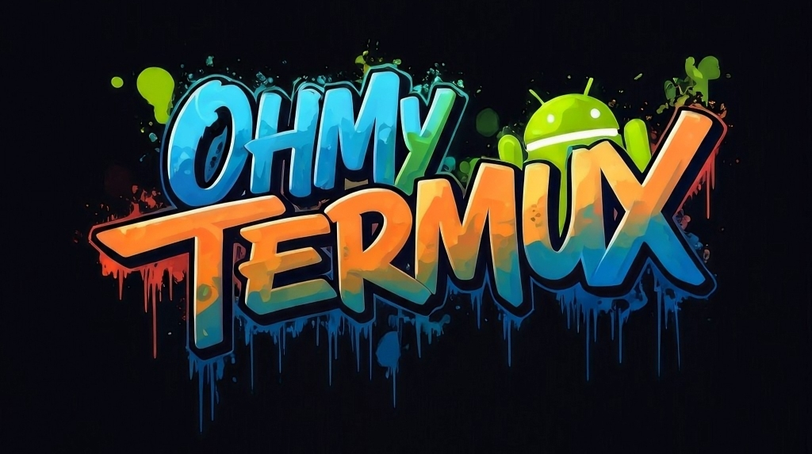

# OhMyTermux 🧊

### **De la sélection d'un shell à l'application d'un pack de curseurs afin de cliquer avec style dans les menus d'un environnement de développement Debian complet tenant dans votre poche : des dizaines de paramètres sont disponibles dans [OhMyTermux](https://github.com/GiGiDKR/OhMyTermux).**

## Installation

1. Installez Termux depuis [F-Droid](https://f-droid.org/en/packages/com.termux) ou [GitHub](https://github.com/termux/termux-app). Sinon, utilisez la version [Play Store](https://play.google.com/store/apps/details?id=com.termux&pcampaignid=web_share) qui a été récemment mise à jour.

2. Installez **OhMyTermux** avec **[Gum](https://github.com/charmbracelet/gum)** 🔥 :
```bash
curl -sL https://raw.githubusercontent.com/GiGiDKR/OhMyTermux/1.0.0/install.sh -o install.sh && chmod +x install.sh && ./install.sh --gum
```

>[!IMPORTANT]
> [Gum](https://github.com/charmbracelet/gum) permet une utilisation simplifiée des scripts CLI, **_il est recommandé_** de l'utiliser en ajoutant l'argument `--gum` ou `-g`.

2. [ALT] Installer OhMyTermux sans Gum 🧊 :
```bash
curl -sL https://raw.githubusercontent.com/GiGiDKR/OhMyTermux/1.0.0/install.sh -o install.sh && chmod +x install.sh && ./install.sh
```

>[!NOTE]
> Il est possible d'exécuter des fonctions indépendamment (et de les combiner) :
>
> ```
> --shell | -sh             # Sélection du shell
> --package | -pk           # Installation des paquets
> --xfce | -x               # Installation de XFCE
> --proot | -pr             # Installation de Debian PRoot
> --font | f                # Sélection de police
> --x11 | -x                # Installation de Termux-X11
> --skip | -sk              # Ignorer la configuration initiale
> --verbose | -v            # Sorties détaillées
> --help | -h               # Afficher l'aide
> ```

## À propos de ce programme

### Termux

<détails>

<summary>Packages installés par défaut</summary>

- [wget](https://github.com/mirror/wget)
- [curl](https://github.com/curl/curl)
- [git](https://github.com/git/git)
- [unzip](https://en.m.wikipedia.org/wiki/ZIP_(file_format))

</détails>

<détails>

<summary>Packages sélectionnables individuellement</summary>

- [nala](https://github.com/volitank/nala)
- [eza](https://github.com/eza-community/eza)
- [lsd](https://github.com/lsd-rs/lsd)
- [logo-ls](https://github.com/Yash-Handa/logo-ls)
- [bat](https://github.com/sharkdp/bat)
- [lf](https://github.com/gokcehan/lf)
- [fzf](https://github.com/junegunn/fzf)
- [glow](https://github.com/charmbracelet/glow)
- [python](https://github.com/python)
- [nodejs](https://github.com/nodejs/node)
- [nodejs-lts](https://github.com/nodejs/Release)
- [micro](https://github.com/zyedidia/micro)
- [vim](https://github.com/vim/vim)
- [neovim](https://github.com/neovim/neovim)
- [lazygit](https://github.com/jesseduffield/lazygit)
- [open-ssh](https://www.openssh.com/)

</détails>

<détails>

<summary>Sélection du shell</summary>

- [Bash](https://git.savannah.gnu.org/cgit/bash.git/)
- [ZSH](https://www.zsh.org/)
- [Fish](https://github.com/fish-shell/fish-shell)

</détails>

<détails>

<summary>Configuration Zsh</summary>

- [Oh-My-Zsh](https://github.com/ohmyzsh/ohmyzsh)
- [zsh-syntax-highlighting](https://github.com/zsh-users/zsh-syntax-highlighting)
- [zsh-completions](https://github.com/zsh-users/zsh-completions)
- [zsh-you-should-use](https://github.com/MichaelAquilina/zsh-you-should-use)
- [zsh-alias-finder](https://github.com/ohmyzsh/ohmyzsh/tree/master/plugins/alias-finder)

</détails>

<détails>

<summary>Configuration de Fish</summary>

- [Oh-My-Fish](https://github.com/oh-my-fish/oh-my-fish)
- [Fisher](https://github.com/jorgebucaran/fisher)
- [Pure](https://github.com/pure-fish/pure)
- [Fishline](https://github.com/0rax/fishline)
- [Virtualfish](https://github.com/justinmayer/virtualfish)
- [Conseils sur les abréviations de poisson](https://github.com/gazorby/fish-abbreviation-tips)
- [Bang-Bang](https://github.com/oh-my-fish/plugin-bang-bang)
- [Poisson que vous devriez utiliser](https://github.com/paysonwallach/fish-you-should-use)
- [Catppuccin pour poisson](https://github.com/catppuccin/fish)

</détails>

<détails>

<summary>Affichage Termux</summary>

- [Polices Nerd](https://github.com/ryanoasis/nerd-fonts)
- [Powerlevel10k](https://github.com/romkatv/powerlevel10k)

</details>

<details>

<summary>Configuration de Termux</summary>

- Alias ​​personnalisés (alias communs + alias spécifiques en fonction du package ou du plugin installé)

</details>

### **XFCE**

- Configurer un bureau Termux [XFCE](https://wiki.termux.com/wiki/Graphical_Environment#XFCE) natif.

- L'utilisation de [Termux-X11](https://github.com/termux/termux-x11) plutôt que VNC a été retenue. Le serveur Termux-x11 sera installé ainsi que l'APK Android. Une fenêtre contextuelle vous demandant d'autoriser les installations à partir de Termux sera affichée. Si vous ne le souhaitez pas, installez l'APK depuis votre répertoire de téléchargement.

- 3 configurations sont disponibles :
<details>

<summary>Minimale</summary>

Uniquement les paquets nécessaires :
```
termux-x11-nightly       # Termux-X11
virglrenderer-android    # VirGL
xfce4                    # XFCE
xfce4-terminal           # Terminal
```
</details>

<details>

<summary>Recommandée</summary>

Installation minimale + les paquets suivants :
```
netcat-openbsd            # Utilitaire réseau
pavucontrol-qt            # Contrôle du son
thunar-archive-plugin     # Archives
wmctrl # Contrôle des fenêtres
xfce4-notifyd             # Notifications
xfce4-screenshooter       # Capture d'écran
xfce4-taskmanagerb        # Gestionnaire des tâches
xfce4-whiskermenu-plugin  # Menu Whisker
```
Et les éléments d'interface suivants :
```
WhiteSur-Theme           # https://github.com/vinceliuice/WhiteSur-gtk-theme
WhiteSur-Icon            # https://github.com/vinceliuice/WhiteSur-icon-theme
Fluent-Cursors           # https://github.com/vinceliuice/Fluent-cursors
WhiteSur-Wallpapers      # https://github.com/vinceliuice/WhiteSur-wallpapers
```
</details>

<details>

<summary>Custom</summary>

Le contenu de l'installation minimale + le choix parmi :
```
jq                       # Utilitaire JSON
gigolo                   # Gestionnaire de fichiers
mousepad                 # Éditeur de texte
netcat-openbsd           # Utilitaire réseau
parole                   # Lecteur multimédia
pavucontrol-qt           # Contrôle du son
ristretto                # Gestionnaire d'images
thunar-archive-plugin    # Archives
thunar-media-tags-plugin # Média
wmctrl                   # Contrôle de fenêtre
xfce4-artwork            # Illustration
xfce4-battery-plugin     # Batterie
xfce4-clipman-plugin     # Presse-papiers
xfce4-cpugraph-plugin    # Graphique CPU
xfce4-datetime-plugin    # Date et heure
xfce4-dict               # Dictionnaire
xfce4-diskperf-plugin    # Performances du disque
xfce4-fsguard-plugin     # Surveillance du disque
xfce4-genmon-plugin      # Widgets génériques
xfce4-mailwatch-plugin   # Surveillance du courrier électronique
xfce4-netload-plugin     # Chargement réseau
xfce4-notes-plugin       # Notes
xfce4-notifyd            # Notifications
xfce4-places-plugin      # Lieux
xfce4-screenshooter      # Capture d'écran
xfce4-taskmanager        # Gestionnaire des tâches
xfce4-systemload-plugin  # Chargement du système
xfce4-timer-plugin       # Minuterie
xfce4-wavelan-plugin     # Wi-Fi
xfce4-weather-plugin     # Informations météo
xfce4-whiskermenu-plugin # Menu Whisker
```
Le choix parmi les éléments d'interface suivants :

Thème :
```
WhiteSur-Theme           # https://github.com/vinceliuice/WhiteSur-gtk-theme
Fluent-Theme             # https://github.com/vinceliuice/Fluent-gtk-theme
Lavanda-Theme            # https://github.com/vinceliuice/Lavanda-gtk-theme
```
Icônes :
```
WhiteSur-Icon            # https://github.com/vinceliuice/WhiteSur-icon-theme
McMojave-Circle          # https://github.com/vinceliuice/McMojave-circle-icon-theme
Tela-Icon                # https://github.com/vinceliuice/Tela-icon-theme
Fluent-Icon              # https://github.com/vinceliuice/Fluent-icon-theme
Qogir-Icon               # https://github.com/vinceliuice/Qogir-icon-theme
```
Curseurs :
```
Fluent-Cursors           # https://github.com/vinceliuice/Fluent-cursors
```
Fonds d'écran :
```
WhiteSur-Wallpapers      # https://github.com/vinceliuice/WhiteSur-wallpapers
```
</details>

- La possibilité d'installer un navigateur Web, soit [Chromium](https://www.chromium.org/) ou Firefox.

> [!IMPORTANT]
> L'installation recommandée utilise environ **4 Go** d'espace disque

### Debian
[Debian PRoot](https://wiki.termux.com/wiki/PRoot) avec un [installateur d'application](https://github.com/GiGiDKR/App-Installer) qui ne sont pas disponibles avec Termux ou les gestionnaires de paquets Debian.

## Utilisation

🧊 Démarrage du bureau

- Pour démarrer une session Termux-X11, utilisez ```start```

- Pour accéder à l'installation de Debian PRoot depuis le terminal, utilisez ```debian```

🧊 Debain Proot

- Il existe deux scripts disponibles pour cette configuration :

- ```prun```  L'exécution de ceci suivie d'une commande que vous souhaitez exécuter depuis l'installation de Debian proot vous permettra d'exécuter des éléments depuis le terminal termux sans exécuter ```debian``` pour accéder au proot lui-même.

- ```cp2menu``` L'exécution de ceci fera apparaître une fenêtre vous permettant de copier les fichiers .desktop depuis debian proot dans le menu « démarrer » de termux xfce afin que vous n'ayez pas besoin de les lancer fr


> [!CAUTION]
> :warning: Ce projet est en cours de développement, utilisez-le à vos propres risques.
> 
> :construction: État actuel du projet : **beta v1** <sup>(en développement)</sup>
> 
> :information_source: *Je ne suis qu'un programmeur amateur avec quelques compétences en administration système, donc j'apprends de mes erreurs que vous verrez* 👀


# OhMyTermux 🧊

**Installation automatisée et personnalisée de [Termux](https://github.com/termux) : paquets, shell, plugins, prompts, polices et thèmes sélectionnables.**

<details>

<summary>Liste des installations optionnelles</summary>

- **[OhMyTermuxXFCE](https://github.com/GiGiDKR/OhMyTermux/edit/main/README.md#-xfce-et-debian-)** : Un [Debian](https://www.debian.org/) proot-distro personnalisé avec un bureau [XFCE](https://www.xfce.org/) et un **[App-Installer](https://github.com/GiGiDKR/App-Installer)** qui ne sont pas disponibles dans le gestionnaire de paquets.

- **[OhMyTermuxScript](https://github.com/GiGiDKR/OhMyTermuxScript)** : Une collection de scripts utiles, exécutables depuis le script principal ou ultérieurement. [^1]

- **[OhMyObsidian](https://github.com/GiGiDKR/OhMyObsidian)** : Synchronisez Obsidian sur Android en utilisant Termux et Git. [^1]

</details>

## Installation

🧊 Pour installer **OhMyTermux**
```bash
curl -sL https://raw.githubusercontent.com/GiGiDKR/OhMyTermux/1.0.0/install_fr.sh -o install_fr.sh && chmod +x install_fr.sh && ./install_fr.sh
```

>[!IMPORTANT]
> **[Gum](https://github.com/charmbracelet/gum) permet une utilisation simplifiée des scripts CLI, _il est recommandé_ de l'utiliser en ajoutant l'argument `--gum` ou `-g`.**

🔥 Pour installer **OhMyTermux** avec **[Gum](https://github.com/charmbracelet/gum)**
```bash
curl -sL https://raw.githubusercontent.com/GiGiDKR/OhMyTermux/1.0.0/install_fr.sh -o install_fr.sh && chmod +x install_fr.sh && ./install_fr.sh --gum
```

>[!NOTE]
> Il est possible de sélectionner les fonctions indépendamment (et de les combiner) :
> - Installation du shell : `--shell | sh`
> - Installation des paquets : `--package | pkg`
> - Installation des polices : `--font | f`
> - XFCE / Debian-Proot : `--xfce | -x`
> - Ignorer la configuration initiale : `--skip` ou `-sk`
> - :fuelpump: Installation complète : `--full | -f`
> - Afficher les sorties détaillées : `--verbose | -v`
> - Section d'aide : `--help | -h`
&nbsp;

### À propos de ce programme 

<details>

<summary>🧊 Paquets installés par défaut</summary>

- [wget](https://github.com/mirror/wget)
- [curl](https://github.com/curl/curl)
- [git](https://github.com/git/git)
- [unzip](https://en.m.wikipedia.org/wiki/ZIP_(file_format))

</details>

<details>

<summary>🧊 Paquets sélectionnables individuellement</summary>

- [nala](https://github.com/volitank/nala)
- [eza](https://github.com/eza-community/eza)
- [lsd](https://github.com/lsd-rs/lsd)
- [logo-ls](https://github.com/Yash-Handa/logo-ls)
- [bat](https://github.com/sharkdp/bat)
- [lf](https://github.com/gokcehan/lf)
- [fzf](https://github.com/junegunn/fzf)
- [glow](https://github.com/charmbracelet/glow)
- [python](https://github.com/python)
- [nodejs](https://github.com/nodejs/node)
- [nodejs-lts](https://github.com/nodejs/Release)
- [micro](https://github.com/zyedidia/micro)
- [vim](https://github.com/vim/vim)
- [neovim](https://github.com/neovim/neovim)
- [lazygit](https://github.com/jesseduffield/lazygit)
- [open-ssh](https://www.openssh.com/)

</details>

<details>

<summary>🧊 Sélection du shell</summary>

- [Bash](https://git.savannah.gnu.org/cgit/bash.git/)
- [ZSH](https://www.zsh.org/)
- [Fish](https://github.com/fish-shell/fish-shell)

</details>

<details>

<summary>🧊🧊 Configuration Zsh</summary>

- [Oh-My-Zsh](https://github.com/ohmyzsh/ohmyzsh)
- [zsh-syntax-highlighting](https://github.com/zsh-users/zsh-syntax-highlighting)
- [zsh-completions](https://github.com/zsh-users/zsh-completions)
- [zsh-you-should-use](https://github.com/MichaelAquilina/zsh-you-should-use)
- [zsh-alias-finder](https://github.com/ohmyzsh/ohmyzsh/tree/master/plugins/alias-finder)

</details>

<details>

<summary>🧊🧊 Configuration Fish</summary>

- [Oh-My-Fish](https://github.com/oh-my-fish/oh-my-fish)
- [Fisher](https://github.com/jorgebucaran/fisher)
- [Pure](https://github.com/pure-fish/pure)
- [Fishline](https://github.com/0rax/fishline)
- [Virtualfish](https://github.com/justinmayer/virtualfish)
- [Fish Abbreviation Tips](https://github.com/gazorby/fish-abbreviation-tips)
- [Bang-Bang](https://github.com/oh-my-fish/plugin-bang-bang)
- [Fish You Should Use](https://github.com/paysonwallach/fish-you-should-use)
- [Catppuccin pour Fish](https://github.com/catppuccin/fish)

</details>

<details>

<summary>🧊 Affichage Termux</summary>

- [Nerd Fonts](https://github.com/ryanoasis/nerd-fonts)
- [Schémas de couleurs](https://github.com/mbadolato/iTerm2-Color-Schemes)
- [Powerlevel10k](https://github.com/romkatv/powerlevel10k)

</details>

<details>

<summary>🧊 Configuration Termux</summary>

- Alias personnalisés (alias communs + alias spécifiques selon le paquet ou le plugin installé)
- Lien symbolique vers les répertoires utilisateur du stockage interne

</details>

<details>

<summary>🧊 OhMyTermuxScript</summary>

- Sélecteur de thème
- Installateur de Nerd Fonts
- App-Installer (VSCode, PyCharm, Obsidian...)
- Bureau XFCE4 natif Termux sur Termux-X11
- Oh-My-Zsh [^2]
- Oh-My-Posh [^1]
- Electron Node.js
- XDRP (Termux natif ou proot-distro)

</details>

[^1]: En développement : à venir dans la version 1.0
[^2]: Intégré en option dans le script principal
[^3]: En développement (pas de date de sortie prévue)

&nbsp;

## **XFCE et Debian**

Configurez un bureau XFCE termux et une installation Debian proot.
Cette configuration utilise Termux-X11, le serveur termux-x11 sera installé et il vous sera demandé d'autoriser termux à installer l'APK Android.
Vous n'avez qu'à choisir votre nom d'utilisateur et suivre les instructions.

> [!IMPORTANT]
> Cela prendra environ 4 Go d'espace de stockage

<details>

<summary>🧊 Démarrer le bureau</summary>

Vous recevrez une fenêtre contextuelle pour autoriser les installations depuis termux, cela ouvrira l'APK pour l'application Android Termux-X11. Bien que vous n'ayez pas à autoriser les installations depuis termux, vous devrez quand même installer manuellement en utilisant un explorateur de fichiers et en trouvant l'APK dans votre dossier de téléchargements.

Utilisez la commande ```start``` pour lancer une session Termux-X11.

Cela démarrera le serveur termux-x11, le bureau XFCE4 et ouvrira l'application Termux-X11 directement dans le bureau.

Pour entrer dans l'installation Debian proot depuis le terminal, utilisez la commande ```debian```

Notez également que vous n'avez pas besoin de définir l'affichage dans Debian proot car il est déjà configuré. Cela signifie que vous pouvez utiliser le terminal pour démarrer n'importe quelle application GUI et elle démarrera.

</details>

<details>

<summary>🧊 Debian Proot</summary>

Pour entrer dans proot, utilisez la commande ```debian```, à partir de là, vous pouvez installer des logiciels supplémentaires avec apt et utiliser cp2menu dans termux pour copier les éléments du menu vers le menu xfce de termux.

Il existe deux scripts disponibles pour cette configuration :

```prun``` En exécutant ceci suivi d'une commande que vous souhaitez exécuter depuis l'installation debian proot, vous pourrez exécuter des choses depuis le terminal termux sans avoir à exécuter ```debian``` pour entrer dans le proot lui-même.

- ```cp2menu``` L'exécution de cette commande fera apparaître une fenêtre vous permettant de copier les fichiers .desktop de Debian proot dans le menu « démarrer » de termux xfce afin que vous n'ayez pas besoin de les lancer depuis le terminal. Un lanceur est disponible dans la section du menu Système.

</details>

&nbsp;

> [!AVERTISSEMENT]
> **Processus terminé (signal 9) - appuyez sur Entrée**

<détails>

<summary>Comment corriger cette erreur Termux</summary>

Vous devez exécuter cette commande adb pour corriger l'erreur du processus 9 qui forcera la fermeture de Termux :
```
adb shell "/system/bin/device_config put activity_manager max_phantom_processes 2147483647"
```
Pour faire cela sans utiliser de PC, vous avez plusieurs méthodes :
Tout d'abord, connectez-vous au WIFI.

**Méthode 1 :**
Installez adb dans Termux en exécutant ce code :
```
pkg install android-tools -y
```
Ouvrez ensuite les paramètres et activez les options du développeur en sélectionnant « À propos du téléphone », puis appuyez 7 fois sur « Créer ».

Revenez à ce menu et accédez aux options du développeur, activez le débogage sans fil, puis cliquez dessus pour obtenir le numéro de port, puis cliquez sur « Appairer l'appareil » pour obtenir le code d'appairage.

Mettez les paramètres en mode écran partagé en appuyant sur le bouton carré en bas à droite de votre téléphone et maintenez l'icône des paramètres enfoncée jusqu'à ce que l'icône d'écran partagé apparaisse.

Sélectionnez ensuite Termux et dans les paramètres, sélectionnez « Appairer avec un code ». Dans Termux, saisissez « adb pair » puis saisissez vos informations d'appairage.

Une fois ce processus terminé, vous pouvez saisir adb connect et vous connecter à votre téléphone avec l'adresse IP et le port fournis dans le menu de débogage sans fil. Vous pouvez ensuite exécuter la commande fix :

```adb shell "/system/bin/device_config put activity_manager max_phantom_processes 2147483647"```

**Méthode 2 :**

Installez LADB depuis [Playstore](https://play.google.com/store/apps/details?id=com.draco.ladb) ou depuis [GitHub](https://github.com/hyperio546/ladb-builds/releases).

En écran partagé, ayez un côté LADB et l'autre côté affichant les paramètres du développeur.
Dans les paramètres du développeur, activez le débogage sans fil, puis cliquez dessus pour obtenir le numéro de port, puis cliquez sur associer l'appareil pour obtenir le code d'association.
Entrez ces deux valeurs dans LADB.
Une fois connecté, exécutez la commande fix :

```adb shell "/system/bin/device_config put activity_manager max_phantom_processes 2147483647"```

</details>

&nbsp;

## 💻 Historique des versions

Version 1.0.0 :
- Version initiale

&nbsp;

## 📖 À faire
- [X] Installation séparée de XFCE / Debian pour exécuter le XFCE natif de Termux
- [X] Ajouter des éléments d'interface graphique sélectionnables (Thèmes, Polices, Curseurs, Fonds d'écran)
- [X] Ajouter un mot de passe pour l'utilisateur proot Debian
- [ ] Intégrer la configuration de Fish (Plugins, Prompts, Alias)
- [ ] Ajouter plus de paquets sélectionnables
- [ ] Ajouter des modules Python
- [ ] Intégrer une sélection de thèmes Termux
- [ ] Intégration de [OhMyTermuxScript](https://github.com/GiGiDKR/OhMyTermuxScript)
- [ ] Intégration de [OhMyObsidian](https://github.com/GiGiDKR/OhMyObsidian)

&nbsp;

> [!TIP]
> 🚩 La version anglaise est [disponible](README.md).
